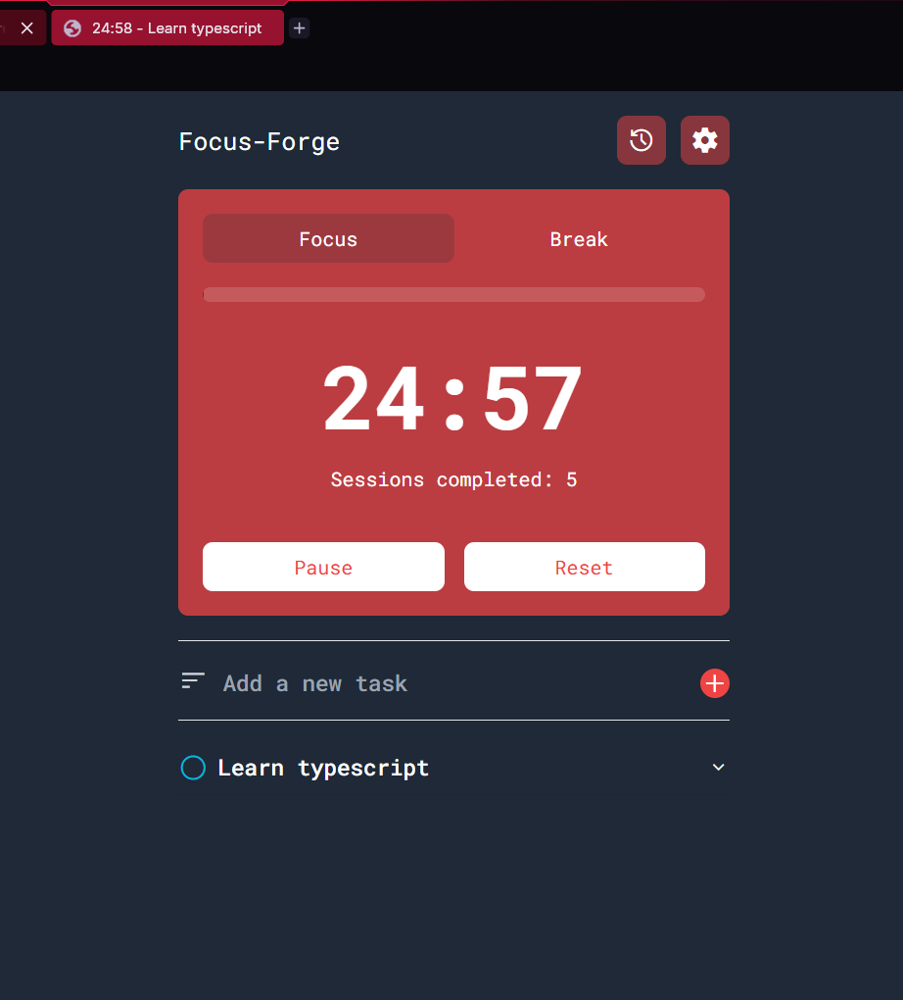
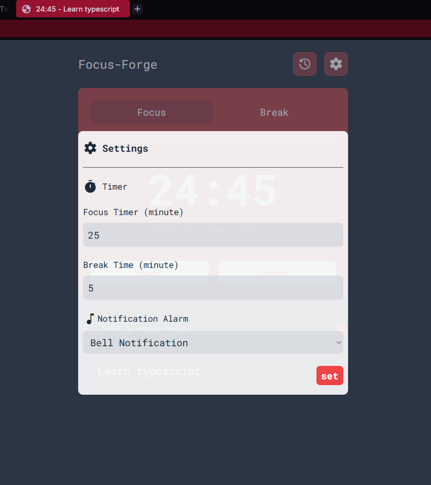

# Focus-Forge (Vanilla JS Version) 🎯

A simple Pomodoro Timer and Task Manager app built using HTML,Tailwind CSS, and JavaScript to help improve focus.

## Screenshot
<table>
  <tr>
    <td align="center">
      
       
      <em>Main Page</em>
    </td>
    <td align="center">
      
       
      <em>Settings</em>
    </td>
  </tr>
</table>

---

## Key Features
- **Timer Pomodoro:** Manageable focus and rest sessions.
- **Task List:** Add, delete, and mark completed tasks.
- **Browser Notification:** Given notification if session(break or focus) completed.
- **Responsive Design:** Good display on both desktop and mobile.
- **Interactive Tab:** the title of browser tab will change depends on countdown of the session and the first unfinished task. if the session is break the title tab will be "break" and show the countdown

---

## Teknology Used
- HTML5
- Tailwind CSS
- Google icon
- JavaScript (Vanilla JS)

---
